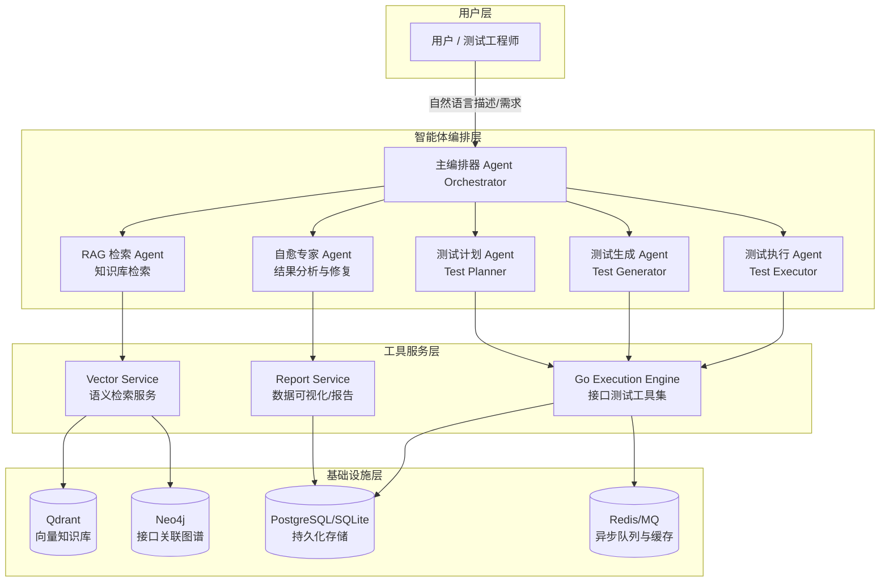
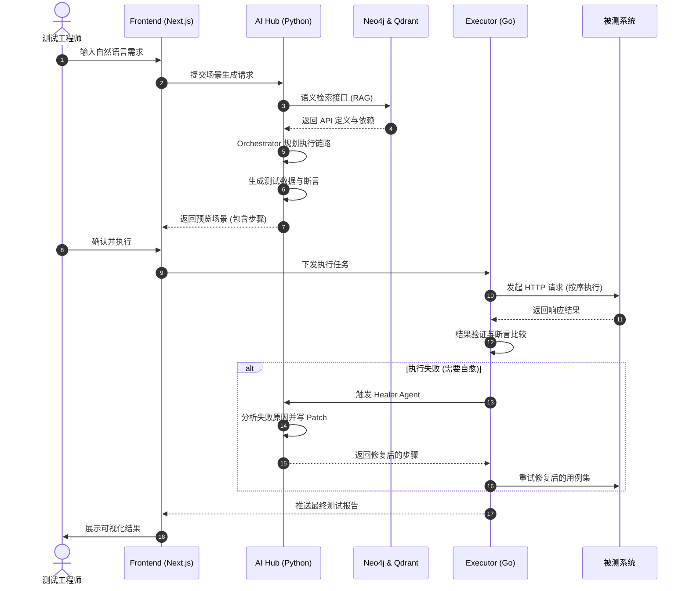

# 智测未来：AI + 知识图谱驱动的智能化接口测试平台实践分享

---

## 1. 解决的痛点

在传统的接口自动化测试中，我们经常面临以下难题：

| 痛点 | 描述 |
|------|------|
| **语义幻觉与逻辑断层** | 通用 AI 在生成测试用例时，不了解业务上下文，导致参数生成「牛头不对马嘴」，无法处理多接口间的复杂依赖。 |
| **高昂的维护成本** | 接口一旦变更，测试脚本往往需要手动大规模重写，自愈能力缺失。 |
| **数据围城** | 海量接口文档（Swagger 等）缺乏有效的语义检索和关联分析，难以快速构建业务场景。 |
| **断言覆盖不足** | 人工编写断言费时费力，难以覆盖所有字段的逻辑校验。 |
| **多数据源割裂** | Swagger、Postman、HAR 等格式分散，缺乏统一导入与向量化能力。 |

本平台围绕上述痛点，通过 **AI Agent + 知识图谱 + 向量 RAG + 自愈** 构建闭环，将测试设计效率从「小时级」压缩到「分钟级」。

---

## 2. 平台概述

**智测未来** 是一个基于 **AI Agent + 知识图谱 (Knowledge Graph) + 向量检索 (RAG)** 的智能化接口测试平台。它旨在将测试工程师从繁琐的脚本编写中解放出来，通过**自然语言描述**即可自动生成、执行并维护复杂的业务测试场景。

**核心价值**：
- 自然语言 → 结构化测试场景 → 一键执行 → 智能自愈
- 多数据源统一导入、向量化与图谱化，支持语义检索与依赖推导
- 全栈覆盖：前端（Next.js）、AI 枢纽（Python）、编排与执行（Go）、持久化（PostgreSQL / Neo4j / Qdrant / Redis）

---

## 3. 技术：架构、核心特性、技术架构

### 3.1 核心特性

- **🤖 智能体驱动生成**：多 Agent 协作，从需求拆解到用例生成全流程自动化。
- **🧠 知识图谱导航**：利用 Neo4j 存储接口间依赖关系，精准推导调用链路，消除 AI 幻觉。
- **🔍 语义 RAG 检索**：基于 Qdrant 的向量检索，实现语义级的接口定位与相似场景推荐。
- **🛡️ 智能自愈 (Self-Healing)**：接口变更后，AI 自动分析失败根因并支持在线修复脚本（分析 + 应用修复）。
- **📊 全量智能断言**：AI 根据接口定义与业务上下文，自动生成多维度的参数与结构化断言（status_code / response_schema / business_logic）。
- **📅 定时任务调度**：基于 APScheduler 的 Cron 定时执行场景，支持启用/停用/删除。
- **📤 项目导出**：支持按项目导出接口与场景数据，便于备份与迁移；后续可扩展 MeterSphere 等生态对接。

### 3.2 技术架构

系统采用**微服务架构**，职责划分如下：

| 层级 | 技术 | 职责 |
|------|------|------|
| **前端** | Next.js 14, TypeScript, Tailwind, Ant Design | 测试中心、API 管理、报告、项目/环境设置、定时任务 |
| **AI 枢纽** | Python / FastAPI / LangChain | NLU、场景解析、RAG 增强、多 Agent 编排、自愈、向量化、报告生成 |
| **场景编排** | Go / Gin | 场景与用例 CRUD、任务调度、与 AI 服务联动 |
| **测试执行** | Go / Resty | HTTP 请求执行、参数映射、断言引擎、执行报告 |
| **知识图谱** | Go / Neo4j 驱动 | 图数据读写、依赖关系管理（可扩展 DEPENDS_ON、PROVIDES_DATA 等） |
| **持久化** | PostgreSQL / SQLite, Neo4j, Qdrant, Redis | 业务元数据、图、向量、缓存；生产可用 Docker Compose 一键拉起 |

### 3.3 整体架构图

---

## 4. 核心技术栈

| 分类 | 技术选型 |
|------|----------|
| **前端** | Next.js 14, React 18, TypeScript, Tailwind CSS, Ant Design, Lucide Icons |
| **后端** | Go 1.21+ (Gin, GORM, Resty), Python 3.11+ (FastAPI, LangChain, OpenAI SDK) |
| **大模型** | GPT-4 / GPT-4o, OpenAI Embeddings (text-embedding-3-small) |
| **数据库** | PostgreSQL 15, Neo4j 5.12, Qdrant 1.7+, SQLite（轻量/本地） |
| **中间件** | Redis 7, RabbitMQ 3 |
| **运维** | Docker / Docker Compose, APScheduler（定时任务） |

---

## 5. 智能体体系

平台采用**多智能体协同**模型，当前已实现并接入流程的包括：

| 智能体 | 职责 | 实现位置 |
|--------|------|----------|
| **Orchestrator（编排专家）** | 意图识别、任务拆解、子智能体调度 | `agents/orchestrator.py` |
| **Analyst（分析专家）** | 解析接口文档、提取核心链路 | 融入 NLU + 场景解析 + API Planner |
| **Planner（策划专家）** | 设计测试用例类型：正向、边界、健壮性、安全 | `services/api_planner.py` |
| **Healer（自愈专家）** | 失败根因分析、可自愈判断、生成修复建议并支持应用修复 | `agents/healer.py` |
| **Reporter（报告专家）** | 业务维度的测试总结与统计 | `services/report_service.py` |

意图类型包括：`generate_test`、`analyze_api`、`execute_test`、`fix_test`、`generate_report`，由 Orchestrator 识别后分发至对应能力。

---

## 6. 工具集成

- **多源导入**：  
  - **Swagger/OpenAPI**：URL 或本地文件，解析 paths、parameters、requestBody、responses。  
  - **Postman Collection**：解析 item 与 request，转为统一 API 模型。  
  - **HAR 流量录制**：从 HAR 中提取请求 URL、方法、请求头、请求体，用于快速补全接口库。  
- **统一适配器**：`DataSourceAdapter` 抽象，工厂按 `source_type` 选择 SwaggerAdapter / PostmanAdapter / HARAdapter，输出统一 API 列表并写入 DB + 向量化。
- **环境与配置**：项目级环境管理（如 base_url），支持在执行计划/场景执行时按环境选取配置；配置可随项目导出。

---

## 7. 数据模型

### 7.1 核心实体关系

| 实体 | 说明 |
|------|------|
| **Project** | 租户/项目级隔离，关联环境、接口、场景。 |
| **API** | 接口定义：path、method、summary、description、parameters、request_body、headers；支持向量索引用于 RAG。 |
| **KG Relation** | 图映射（Neo4j）：如 `DEPENDS_ON`、`PROVIDES_DATA` 等，用于推导调用顺序（可扩展）。 |
| **Scenario** | 场景：自然语言描述、解析后的结构化执行序列（名称、描述、步骤列表）。 |
| **TestCase** | 执行用例：关联 Scenario，包含 steps（步骤顺序、API、参数、param_mappings、assertions、expected_status）。 |
| **TestStep** | 单步：api_id、api_path、api_method、params、headers、param_mappings、assertions、expected_status、timeout。 |
| **ParamMapping** | 参数映射：from_step、from_field、to_field，用于步骤间数据传递。 |
| **Assertion** | 断言：type（status_code / response_schema / business_logic）、field、operator、expected_value、description。 |
| **TestExecution** | 执行记录：关联 test_case 或计划执行，保存 status、result、duration_ms、error_msg、步骤级请求/响应。 |
| **ScheduledJob** | 定时任务：关联 scenario_id、cron_expression、is_active，由 APScheduler 调度。 |
| **HealingRecord** | 自愈记录：关联 test_case_id、execution_id，记录 Healer 分析与应用修复结果。 |

### 7.2 与执行引擎的对应

- Go 侧 **TestStep** 与 Python 侧生成的步骤结构一致，包含 `ParamMappings`、`Assertions`、`ExpectedStatus`。
- 执行引擎通过 **ExecutionContext** 按步骤顺序解析 `param_mappings`，将前序步骤的响应字段注入后续请求。

---

## 8. 工作流程

### 8.1 主流程简述

1. **注入**：导入 Swagger/Postman/HAR → 适配器解析 → 写入 DB → 向量化入 Qdrant（可选写 Neo4j）。
2. **描述**：用户在「测试中心」输入自然语言需求（如「用户改地址后下单买耳机」）。
3. **解析**：AI 通过 RAG 检索相关接口，结合图谱（若已构建）推导调用顺序；NLU + ScenarioParser 生成结构化 steps。
4. **生成**：DataGenerator 按策略（smart/valid/boundary/invalid/random）生成请求数据；AssertionGenerator 生成断言。
5. **执行**：Go 引擎按步骤顺序执行 HTTP 请求，应用 param_mappings，断言引擎校验 status_code / response_schema / business_logic。
6. **自愈**：若失败，前端或接口触发 Healer 分析（`/api/v1/heal/analyze`）；对场景用例可调用「应用修复」（`/api/v1/heal/apply`）写回 steps。

### 8.2 业务流向图

---

## 9. 业务实战

### 9.1 场景示例：用户改地址后下单

- **输入**：用户改了地址后，立刻买个耳机。
- **系统表现**：
  - 自动关联加载 `GET /user/info` 获取地址列表。
  - 调用 `PUT /user/address` 更新指定 ID 地址。
  - 检索获取耳机商品 ID，调用 `POST /order/create`。
  - 断言：订单中的 `shipping_address` 与更新后的值一致。

### 9.2 接口测试计划（API Planner）

- **入口**：API 管理 → 接口测试计划。
- **流程**：选择项目 → 生成测试计划（positive / boundary / robustness / security）→ 填写 Base URL 或使用环境配置 → 执行计划 → 查看执行结果与失败分析。
- **失败分析**：调用 Healer 分析失败原因，展示 failure_type、root_cause、suggested_fix、patch_hint；场景用例支持「应用修复」写回步骤。

### 9.3 自愈（Healer）使用方式

- **仅分析**：`POST /api/v1/heal/analyze`，传入 `execution_id`，可选 `step_index`。
- **分析并应用修复**：`POST /api/v1/heal/apply`，传入 `test_case_id`、`execution_id`，后端修改该场景的 steps 并写入 healing_records。

---

## 10. 你可能没想到的（补充亮点）

| 能力 | 说明 |
|------|------|
| **定时任务** | 按 Cron 表达式定时执行指定场景，支持启用/停用/删除，便于回归与巡检。 |
| **项目级环境** | 环境管理（如 base_url）与项目绑定，执行时自动选用，无需每次手填。 |
| **单接口测试** | 在 API 列表中可对单接口发起请求并查看响应，便于联调与快速验证。 |
| **报告详情页** | 执行报告支持列表与详情（按执行 ID），展示步骤级请求/响应、断言结果、统计信息。 |
| **Healer 应用修复 API** | 不仅可看分析结果，还可通过接口将修复方案写回场景步骤，实现「分析 → 修复」闭环。 |
| **API Planner 多类型用例** | 一次生成正向、边界、健壮性、安全四类用例骨架，为后续数据与断言生成提供基础。 |
| **项目导出** | 按项目导出接口与场景数据，便于备份、迁移及后续对接 MeterSphere 等平台。 |
| **轻量部署** | 支持 SQLite + 单进程 Python 服务（如 `main_sqlite.py`），无需强制 PostgreSQL/Neo4j，适合本地与试点。 |

---

## 11. 总结与后续工作

### 11.1 现状总结

- 测试设计效率提升明显（从小时级缩短至分钟级），自然语言即可生成可执行场景。
- 通过 RAG + 知识图谱（可选）约束生成结果，缓解纯 LLM 的幻觉与逻辑断层。
- 自愈链路打通：失败分析 + 应用修复，减少人工改脚本成本。
- 多数据源、多智能体、定时任务、报告与项目导出已形成完整闭环，可支撑团队日常使用与试点推广。

### 11.2 后续规划

1. **生态扩展**：支持一键导出至 MeterSphere，实现与企业现有测试资产的兼容。
2. **监控告警**：对接企业微信/飞书机器人，执行失败或异常时 Webhook 告警。
3. **AI 录制增强**：基于线上真实流量（如 HAR 持续导入）自动补充与更新业务图谱。
4. **知识图谱深度应用**：在场景解析时优先走 Neo4j 依赖路径，再结合 RAG 排序与补全。
5. **性能预测**：根据接口定义复杂度，由 AI 建议性能压测方案或自动生成压测场景。

---

> “在 AI 的加持下，每个测试工程师都是自己项目的首席架构师。”
