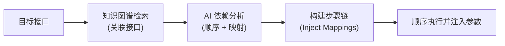

# 自动依赖链 - 实现逻辑（知识图谱 + AI）

## 1. 背景与目标
单接口用例执行时，目标接口可能依赖其他接口的返回值（如 token、sessionId 等）。当前不处理依赖导致执行失败（如"token已过期"）。
本方案旨在通过**知识图谱检索**结合 **AI 推理**，自动识别并构建前置依赖链，实现参数的自动注入。

## 2. 核心架构
采用"检索 + 推理"两阶段协作模式：

1. **知识图谱检索阶段**：
   - 使用 `rag_query_data(mode="mix")`。
   - 根据目标接口的 Path、Method、Summary 等信息，在项目接口库中检索关联接口。
   - 目的：缩小 AI 分析的范围，提高准确率并节省 Token。

2. **AI 推理阶段**：
   - 将目标接口详情及知识图谱检索出的关联接口列表传给 AI。
   - AI 分析确定：
     - 是否存在真实依赖。
     - 依赖的顺序（如：登录 -> 获取房间 -> 目标接口）。
     - 参数提取路径与注入位置（如：从登录返回提取 `data.token` 注入到目标的 `Authorization` 头）。

## 3. 实现细节

### 3.1 关键逻辑
- **依赖解析器 (`_resolve_dependencies`)**：插入在执行流水线中，在步骤执行前动态构建步骤链。
- **参数映射 (`param_mappings`)**：利用现有的步骤间参数传递机制，实现 Token 和业务参数（如 roomId）的自动流动。
- **智能过滤**：
  - 自动跳过登录接口自身的前置依赖分析。
  - 对于不需要鉴权的简单 GET 请求，不启动依赖分析。

### 3.2 流程示意图

## 4. 边界处理与降级
- **最大深度限制**：依赖链限制在 3 层以内，防止循环依赖。
- **自动降级**：若 AI 分析失败或网络异常，自动回退到"直接执行"模式，确保不影响原有流程。
- **缓存机制**：对分析结果进行缓存（project_id + path 维度），避免重复触发模型调用。

## 5. 验证标准
- "开台立结"接口：应自动执行登录并注入 token，不再返回认证失败。
- 登录接口：不应产生前置依赖。
- 执行性能：增加依赖分析后的总体耗时增加应在可接受范围内。
